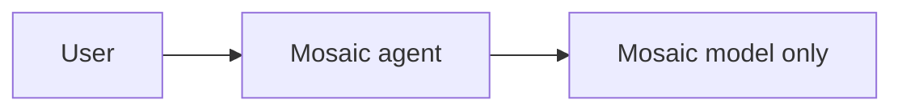
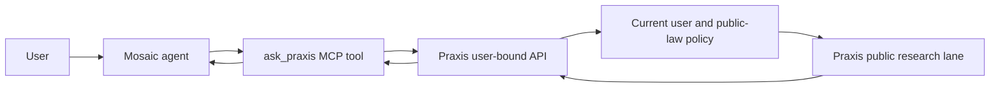

# Praxis Legal for Mosaic

We want a Mosaic agent to ask Praxis a public-law question and receive the orchestrator's answer. The add-on uses Mosaic's MCP tool path. Praxis exposes a user-bound `/v1/chat/completions` endpoint; Phoenix checks the signed-in user before it calls the private research orchestrator.

**Before**



**After**



The catalog add-on also has an **Ask Praxis** tab for a direct connection check. Mosaic's own agent can call the same MCP tool in chat. The tab uses `mcp:read` and `mcp:call`; the MCP server holds a reference to the user's Praxis key.

Mosaic's catalog tarball contains only the add-on renderer and manifest. Install this MCP server separately before using the tab or agent tool. Catalog installation does not register the MCP server.

## Local setup

Install the MCP server's dependencies:

```sh
cd addons/praxis-legal/mcp
npm install
```

Sign in to Praxis and create a Mosaic key at `/dashboard/mosaic`. Save the one-time key in 1Password. Register the server in Mosaic with your Praxis origin and its secret reference:

```sh
PRAXIS_BASE_URL=https://your-praxis-instance.example \
PRAXIS_MOSAIC_TOKEN_REF=op://your-vault/your-item/your-field \
node setup.mjs
```

The setup stores the URL and secret **reference** in Mosaic's MCP configuration. It does not store the token. The MCP server resolves the reference with `op read` when called. Refresh **Settings → MCP Servers**, then ask a Mosaic agent to use `ask_praxis` for a public-law question. You can also load this add-on from the Dev corner and use its tab to verify the tool response directly. Click **Check connection** in the tab after connecting the MCP server.

For direct chat without MCP, configure a **Custom** Mosaic agent with the same Praxis origin, model `praxis-legal`, and your user-bound key. Mosaic encrypts agent API keys at rest. Praxis keys expire after 30 days and can be revoked from `/dashboard/mosaic`. The endpoint uses `Core.Capabilities.public_legal_research/2`; it runs the public research lane without firm documents or graph scope. Ask public-law questions only. Do not include client or matter facts. Mosaic keeps chat history on the device.

## Checks

```sh
node --test addons/praxis-legal/test/*.test.mjs
node scripts/build-addon.mjs praxis-legal
```

## Verified result

On 2026-10-06, the first local proof used an operator-only Fly proxy to reach the private sidecar. Mosaic's MCP client returned a 4,077-character Rule 56 answer (SHA-256 `b4af3f554739a0bebce4b890801f37240fdee45705d901deb35e54b3fc448e14`). A deterministic local model stub then called `ask_praxis` from AI Chat, received the tool output, and displayed a 5,259-character Praxis response (SHA-256 `7231fc165a67f180542f3e464476dd6b8e2f7929239466c48916aa2267d13200`). Those calls proved the desktop path; they predate the user-bound Phoenix API and are not proof of production authentication.

The catalog entry is not published. A production model's independent choice to use the tool remains unverified. The add-on installed, activated, and rendered its tab in a fresh local Mosaic desktop profile. The tab still needs a connected MCP server and a live user-bound Praxis key for a production answer. Catalog installation does not install the MCP server; users must follow the separate setup above.
